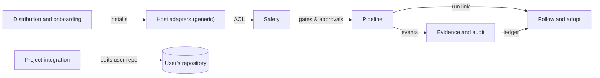

# Context map

Riverwright is divided into bounded contexts, each with one job, its own vocabulary (see
[the ubiquitous language](ubiquitous-language.md)) and its own code. The **Type** follows the usual DDD
classification: *core* is what makes the product distinctive, *supporting* is necessary but not
distinctive, *generic* could be replaced by an off-the-shelf solution.

## The contexts

| Context | Type | Owns | Code today | Status |
|---|---|---|---|---|
| **Pipeline** | Core | runs, stations, gates, budgets, presets, the run record | `scripts/lib/state.mjs`, `presets.mjs`, `paths.mjs` | runtime built; skills and roles planned |
| **Safety** | Core | locks, the guard, the hook and classifier, approvals, the sanitizer | `guard.mjs`, `giturl.mjs`, `hooks/`, `commands/hook.mjs`, `approvals.mjs`, `tty.mjs`, `sanitize.mjs` | built and verified in CI |
| **Follow and adopt** | Core | threads, workarounds, upstreams, the registry, correspondence, adoption | none yet; see [the thread-record spec](../specs/thread-record-and-audit.md) | designed |
| **Project integration** | Supporting | managed blocks, additive merges, backups, ownership markers | `blocks.mjs`, `jsonmerge.mjs`, `diff.mjs`, `project.mjs` | built and verified in CI |
| **Evidence and audit** | Supporting | the fingerprint, the ledger, evidence export, evidence levels | `fingerprint.mjs`, `ledger.mjs`, `evidence.mjs` | built; ledger moves to the hash-chained shape in Plan 2 |
| **Host adapters** | Generic | hosts, adapters, dialects, launching host programs | `hooks/dialects.mjs`, `exec.mjs`, `hosts.mjs` | dialects built; adapters planned |
| **Distribution and onboarding** | Supporting | install commands, the checkup, the setup wizard | none yet | designed |

## Relationships

| Upstream context | Downstream context | Pattern | What crosses |
|---|---|---|---|
| Safety | Pipeline | Customer–supplier | the pipeline asks Safety for gates and approvals; Safety defines what counts as approved |
| Host adapters | Safety | Anti-corruption layer | each host's hook payload and deny format are translated to one internal decision |
| Pipeline | Evidence and audit | Published language | pipeline events (station passed, stopped, approved) are written to the ledger in one shared shape |
| Pipeline | Follow and adopt | Customer–supplier | a run hands over the thread it opened and its run link |
| Evidence and audit | Follow and adopt | Shared kernel | both use the same ledger and event shape |
| Project integration | Pipeline | Separate ways | integration edits a user's repository; the pipeline never does |
| Distribution and onboarding | all | Conformist | it installs and checks whatever the other contexts ship |

## Invariants that cross contexts

1. Nothing outward happens without an approval bound to exact content (Safety, enforced for every context).
2. Text from upstream is data in every context; it passes the sanitizer before it is stored or read by a model.
3. The registry holds public-safe facts only; drafts, logs and environment detail stay in the run record.
4. Only the owning context changes its own records. The follower records events and never changes a status.
5. State is files, re-derived each time; no context relies on conversation memory.

## Diagram

